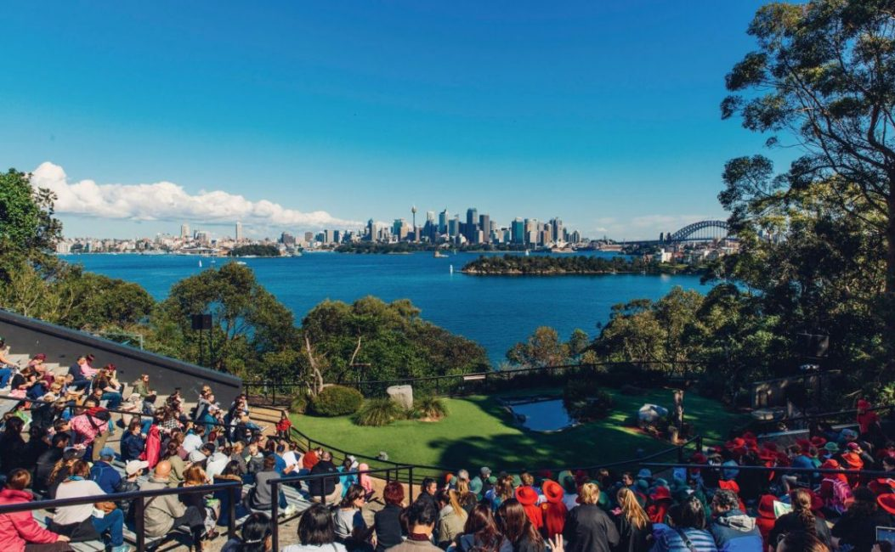

# Starting a blog

In this post, I hope to capture the steps I when creating and publishing this blog.

## Context

> Why do we need another blog?

For the last few years I've wrestled with this question. This question is similar to why take another photo of a popular natural site (i.e. mountain or waterfall) or another photo of your family at the Taronga zoo view of the Sydney city.

I think the arguments can be laid out with the following:
| For | Against |
| ----------------------- | ----------------------- |
| Provide a publicly accessible reference point for digital work products | Waste of time i.e. do something that no one cares about or sees |
| Learn something new | Do something that no one cares about or sees |
||Do something that has already been done a million times|

## Process

| # | Step | Description|
| ----------------------- | ----------------------- |----------------------- |
|1.|Identify what's involved| Figure out the various things involved in setting up a blog

|2. |Make some decisions|

|3. |Publish something|

## Detailed breakdown

### Identify what's involved
To setup a blog you'll need
- Choose an implementation option

### Make some decisions

### Publish something

## Other considerations